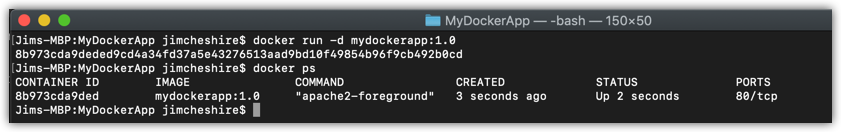
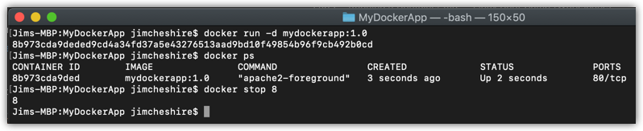

# Lab 2 - Running a Container
In this lab, you will complete the following exercises.

* Run a Docker container based on the image you created in Lab 1.
* Demo a working app running in your Docker container.

## Prerequisites:
In order to complete this lab, you will need:

* An install of [Docker CE](https://www.docker.com/get-started) (https://www.docker.com/get-started). You can run this on any OS. The steps aren't OS-specific.
* Download the contents of the Linux Boot Camp GitHub repository located at https://github.com/jamesche75/Linux-Boot-Camp. (Click **Clone or Download** and download it as a Zip file to your machine.)
* You should have completed Lab 1.

### Optional: ###
* [Visual Studio Code](https://code.visualstudio.com/download) (https://code.visualstudio.com/download) with the [Docker extension](https://code.visualstudio.com/docs/azure/docker) (https://code.visualstudio.com/docs/azure/docker).

---

## Step 1: Run the Container
Let's run a container based on the Docker image you created in Lab 1.

1. From a command prompt, run the following command:

   ``docker run -d mydockerapp:1.0``

2. Run the following command to verify that your container is running.

   ``docker ps``

You should see output similar to the image below.

We can see from this output that our container is running, so let's try and browse to the index.php file.

3. Open a web browser and browse to **http://localhost/index.php**.

You should see an error in the browser. 

> **Knowledge Check:** Why does this fail when browsing to localhost?

The output of ``docker ps`` clearly shows us what's wrong, but you need to understand what it's showing you in order to notice the problem. Look at the ``PORTS`` column. It says:

``80/tcp``

This tells us that the container is listening on port 80, but it also tells us that we aren't mapping a port from the host OS into the container. If we were, it would look something like this:

``
0.0.0.0:80->80/tcp
``

The port on the left of the ``->`` is the port on the host OS that's mapped to the port in the container. 

## Step 2: Stopping the Container

We're going to fix the problem with this container, but first, we need to stop the container. 

1. From a command prompt, run the following command:

   ``docker stop CONTAINER_ID``

Again, you only have to provide enough characters of the container ID so that Docker knows which container you want to stop. In my case, I ran:

``docker stop 8``

You should see output similar to what you see in the figure below.

2. Run ``docker ps`` from your command line. You should no longer see your container. The container's still on the machine, but it's no longer running. 

> **Knowledge Check:** How can you remove the container from the machine completely? We're not going to use it again, so try it out!

## Step 3: Recreating the Container

Now we need to recreate the container with the correct network configuration. Docker creates the network bridge when the container is started, but we still can't use ``docker start`` with our existing container to fix this problem. That's because you set the configuration to use for the network in the ``docker create`` command. (In our case, we'll just do it in ``docker run`` because it allows us to do it in one step instead of two.)

1. From your command prompt, run the following command:

   ``docker run -d -p 8000:80 mydockerapp:1.0``

The only difference between this command and the one you ran before is the ``-p`` option. We use the ``-p`` option to tell Docker what port to map from the host OS into the port that's listening in the container. 

> **More Info:** Why did we use port 8000 instead of port 80? If you're doing this on a Windows machine, the Microsoft HTTP API will be listening on port 80, and that will cause a port conflict. If you're not doing this on a Windows machine, you could have used ``-p 80:80`` to map port 80.

2. Open your web browser and browse to **http://localhost:8000/index.php**.

You should now see the PHPInfo output from Apache running in the container. 

> **Knowledge Check:** How are we able to browse to **localhost** and see content from inside of the container?

