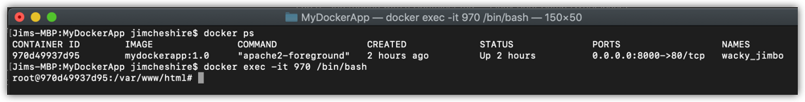

# Lab 3 - Interacting with a Container
In this lab, you will complete the following exercises.

* Run commands in a container using ``docker exec``.
* Access a shell prompt from inside of a container. 
* Copy files to and from a container.

## Prerequisites:
In order to complete this lab, you will need:

* An install of [Docker CE](https://www.docker.com/get-started) (https://www.docker.com/get-started). You can run this on any OS. The steps aren't OS-specific.
* Download the contents of the Linux Boot Camp GitHub repository located at https://github.com/jamesche75/Linux-Boot-Camp. (Click **Clone or Download** and download it as a Zip file to your machine.)
* You should have completed Lab 1 and Lab 2.
* The container you ran in Lab 2 should be running.

### Optional: ###
* [Visual Studio Code](https://code.visualstudio.com/download) (https://code.visualstudio.com/download) with the [Docker extension](https://code.visualstudio.com/docs/azure/docker) (https://code.visualstudio.com/docs/azure/docker).

---

## Running Commands in a Container
As you learned in Module 4, you can use ``docker exec`` to run commands in a container. Let's do some testing with this using the container we started in Lab 2.

1. From a command prompt, run the following command:

   ``docker exec -d CONTAINER_ID touch /var/log/mydockerapp.log``

   As before, replace ``CONTAINER_ID`` with the unique identifier for your running container. 

   > **Knowledge Check:** What does this command do? 

   Because we ran this command with the ``-d`` option, we are returned immediately to the command prompt. Does that mean that the command completed successfully? No, it does not. When we run ``docker exec`` detached, we will get nothing back from ``STDOUT`` or ``STDERR``, so we won't know if there was a problem with our command. Don't believe me? Let's test this.

2. From a command prompt, run the following command:

   ``docker exec -d CONTAINER_ID touch /nosuchdirectory/mydockerapp.log``

> **Tip:** If you are getting tired of checking the container ID, you can rename the container after it's running. Just run the command ``docker rename OLD_NAME NEW_NAME`` to rename your container. (You can see the container name in the output of ``docker ps``.) You can then just use the container name instead of the ID in ``docker`` commands.

It looks like this succeeded, but since there is no directory in our container called **nosuchdirectory**, this actually failed. 

There are some cases where you will get an error with ``docker exec``. For example, if you tell ``docker exec`` to run a command that doesn't exist, it will complain.

3. From your command prompt, run the following command:

   ``docker exec -d CONTAINER_ID blah``

This fails with the following error.

```
OCI runtime exec failed: exec failed: container_linux.go:348: starting container process caused "exec: \"blah\": executable file not found in $PATH": unknown
```
> **Note:** **OCI** refers to the Open Container Initiative. Not all of Docker's CLI code complies with the OCI, but about 75% of it does. That's why you get a nice error here telling you what went wrong.

## Accessing a Shell Prompt in a Container
You can also use ``docker exec`` to open a shell prompt inside of the container. In order to do this, you'll need to have a shell installed, and you need to know what that shell is. For example, you can run Bash in an Ubuntu image, but if you're running a Debian image, you may have to use Ash. 

Let's open a shell prompt in the container that we started earlier. 

1. From your command prompt, run the following command:

   ``docker exec -it CONTAINER_ID /bin/bash``

After running this command, you should see something similar to the image shown below.



2. Enter ``top`` to see processes in your container. 
3. Press ``ESC`` or ``q`` to exit ``top``.
4. Enter ``cat /proc/version`` to see what version of Linux is running in your container. 
5. When you've finished running commands, enter ``exit`` to exit the shell and return to the host OS prompt.

As you can see, using ``docker exec`` to access your container is a powerful way to troubleshoot problems and to run commands within your container. 

## Copying Files to and from a Container
You can copy files to and from a Docker container using ``docker cp``. Let's copy the index.php file from our Docker container to our host OS.

Before we go into this process, we'll rename the container to make this easier to follow.

1. From a command prompt, run the following command:

   ``docker rename OLD_NAME lab_container``

2. Run ``docker ps`` to confirm that the new container name is **lab_container**. 
3. Run the following command to copy the file from the container to the host OS.

   ``docker cp lab_container:/var/www/html/index.php PATH/index.php``

Replace ``PATH`` with a local path where you want to store the file. 

4. Check the path on the host OS and you should see that the index.php file was copied from the container. 

5. Replace the contents of the index.php file that you just copied with the HTML markup shown below.

```
<html>
  <body>
    <h1>New Content</h1>
    <p>This content is replacing the old content.</p>
  </body>
</html>
```
6. Save the changes to index.php.
7. Run the following command to copy the file back to the container.

   ``docker cp PATH/index.php lab_container:/var/www/html/index.php``

8. Open your web browser and browse to http://localhost:8000/index.php.

When you browse to the container this time, you should see the new content in the index.php file. 

By the way, you can copy files to and from the container even when it's stopped. Remember, Docker creates the volumes for a container when it's created, so even if the container hasn't been started, the volumes still exist and you can copy files to and from those volumes.

