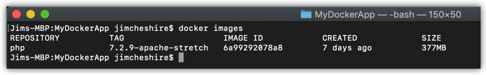

# Lab 4 - Inspecting an Image
In this lab, you will complete the following exercises.

* Learn some really cool tips to work with multiple images and containers.
* Use ``docker inspect`` to inspect an image.
* Use Dockerfiles to track parent inheritance back to a base image.

## Prerequisites:
In order to complete this lab, you will need:

* An install of [Docker CE](https://www.docker.com/get-started) (https://www.docker.com/get-started). You can run this on any OS. The steps aren't OS-specific.
* Download the contents of the Linux Boot Camp GitHub repository located at https://github.com/jamesche75/Linux-Boot-Camp. (Click **Clone or Download** and download it as a Zip file to your machine.)

### Optional: ###
* [Visual Studio Code](https://code.visualstudio.com/download) (https://code.visualstudio.com/download) with the [Docker extension](https://code.visualstudio.com/docs/azure/docker) (https://code.visualstudio.com/docs/azure/docker).

---

## Inspecting an Image with ``docker inspect``
So far, the Docker image you've been working with is one you created yourself. Because of that, you know exactly how the image was created. However, you don't always have that luxury. In cases where you aren't the creator of the image, you can find out a lot about how the image was created by using ``docker inspect``. 

In this exercise, you'll use ``docker inspect`` to look at details on a Docker image. 

### Step 1 : Cleaning Up
We're going to use ``docker inspect`` against a PHP image. Before we do that, let's do a little housecleaning so that your Docker output will be cleaner. This is also a good opportunity to teach you a trick on working with multiple images and containers. 

1. From your command line, run the following command:

   ``docker images -a``

   You probably see the PHP image we used as a parent, along with your **mydockerapp** image. However, you likely also see at least one image that's called ``<none>``. That image is an intermediate image, an image that was used in the building of the **mydockerapp** image. Having intermediate images hanging around doesn't harm anything, but we're going to remove that image along with the other images on your machine so we start from scratch.

   You can use ``docker rmi`` to remove Docker images, but we don't want to have to run ``docker rmi`` multiple times. Fortunately, there's a shortcut we can use to run ``docker rmi`` on all of the images returned by ``docker images``. 

2. From your command line, run the following command:

   ``docker rmi -f $(docker images -a)``

   The ``-f`` option forces removal of an image if ``docker rmi`` can't remove it gracefully. The ``$(COMMAND)`` portion tells ``docker rmi`` to run once for each return value of the command. 

   When you ran this, what did you see? You should have seen a ton of error messages. That's because the parameter that we pass to ``docker rmi`` should be an image ID or an image name. However, when you run ``docker images``, you get the image name and ID, along with a bunch of other information. Fortunately, there's a way to run ``docker images`` and only return the ID of the image. 

3. From your command line, run the following command:

   ``docker images -a -q``

   The result of this command is *only* the image IDs. These image IDs are perfect to pass as parameters to ``docker rmi``, so let's try our new command to remove all of our images.

4. From your command line, run the following command:

   ``docker rmi -f $(docker images -a -q)``

   Did that work? It might have, depending on whether or not you are still running a container using that image. If your container from previous labs is still running, you won't be able to delete the image no matter what you do. 

   Let's use the same technique to stop all running containers. 

5. From your command line, run the following command:

   ``docker stop $(docker ps -f status=running -q)``

   You learned about filtering output using ``-f`` in this module. Now you're getting to put that knowledge to work. We don't want to run ``docker stop`` on a container that's not running. If we do, it will return an error. We only want to run it on containers that are running, so we can filter the results of ``docker ps`` to show us only running containers by using the ``-f`` option. (Notice that we also used the ``-q`` option so that only container IDs were returned.)

6. Now that you've stopped running containers, run the following command again.

   ``docker rmi -f $(docker images -a -q)``

   You may still see an error that says *No such image*, but this can be ignored. After you run this command, you can run ``docker images -a`` again and you'll see that all of the Docker images on your machine are now gone. 

7. From the command prompt, run the following command to remove all Docker containers.

   ``docker rm -f $(docker ps -a -q)``

Now you're completely cleaned out and starting from scratch. There are no Docker images or containers on your machine.

### Step 2: Pulling an Image to Inspect
We created an image earlier by building it on our machine. Now we want to grab an image that's already been built by someone else. To do that, we'll pull the image from Docker Hub.

From your command line, run the following command:

``docker pull php:7.2.9-apache-stretch``

When you run ``docker pull``, Docker downloads the Zip file that contains the image and it extracts the image. Where does it store that image? That depends on the OS you're running. 

* If you're running Docker on Windows (other than Windows Server 2016) or Docker on a Mac, the Docker daemon is actually running in a Linux VM. When you run ``docker pull``, Docker is actually copying the image to the VM in the ``/var/lib/docker`` folder structure. 

* If you're running Docker on Linux, it will store the information in ``/var/lib/docker`` on your machine.

* If you're running Docker on Windows Server 2016, images are stored in C:\ProgramData\Docker by default, but this can be changed by altering the ``data-root`` property in the daemon.json config file. (We don't cover that in this training.)

### Step 3: Inspecting the Image
Now that you've pulled the ``php:7.2.9-apache-stretch`` image, we can use ``docker inspect`` to check it out. Before we do that, we already know quite a bit about this image based on the tag. We know that it likely contains an Apache web server, and we know that it's running Debian 9. How do we know that? Because **Stretch** is the codename for Debain 9. 

Let's confirm these things while learning a lot more about this image. 

1. From your command line, run the following command:

   ``docker images``

   We run this so that we can see the image ID. It's a lot easier to use the image ID in the following commands than it would be to type out the long tag each time. In my case, I see the output in the image below.

   

   When I run the following commands, I'm going to use ``6a`` as my image ID. You will want to use the image ID for the image you see on your machine.

2. From your command line, run the following command:

   ``docker inspect IMAGE_ID``

   After you run this command, scroll all the way to the top of the ouput and look for the ``Parent`` property. You'll see that the value of this property is an empty string. Does that mean this is a base image? It actually doesn't!

   Prior to Docker version 1.1, each Docker image was a single layer. In order to get the entire image necessary to run a container, Docker needed to know the parent for the image, so that property was exposed via ``docker inspect``. In version 1.1 and later, images are self-contained and have a reference to all of the layers necessary. 

   Given that, how do you find out the parent image for this image? Simple. You have to look at the Dockerfile. We'll go into that more a little later in this lab.

You can use ``docker inspect`` to display only certain properties that you're interested in. To do that, you use the ``-f`` option and specify a *Go template*. That sounds more complicated than it really is, so let's look at an example. 

3. From your command prompt, run the following command:

   ``docker inspect -f='{{.Config.Cmd}}' IMAGE_ID``

This will show you the CMD that's run from the Dockerfile. 

> **Extra Credit**: Try some of the cool things you can do with Go templates that are outlined at https://container-solutions.com/docker-inspect-template-magic/.

By the way, ``docker inspect`` doesn't just work for images. You can use it on containers as well.

## Tracking Parent Inheritence

As you saw earlier, you can't rely on ``docker inspect`` to find the parent for an image. Fortunately, if the image is on Dockerhub, you can look at the Dockerfile to find out what the ``FROM`` instruction says for the image. 

> **Note**: If the image is not on Docker Hub, you'll have to go to the registry where the image is stored. However, when people are using images that they didn't create or that aren't owned by their company, it's almost certain that they're from Docker Hub.

I said earlier that the PHP image we were pulling was running Debian 9. I based that off the tag for the image, but let's prove it. 

1. Browse to http://dockerhub.com and log in with your Docker Hub account.
2. In the search box at the top of the page, enter **php** and press **Enter**.

The official PHP image should be at the top of the list. 

3. Click **Details** on the far right side of the PHP image.

Now you'll see a list of supported tags and the Dockerfile for each of them.

4. Scroll down until you find **7.2.9-apache-stretch** and click on it. (It's probably not blue like a hyperlink, but it is a hyperlink.)

This takes you to the Dockerfile that's stored in GitHub. As you can see, the ``FROM`` instruction says:

``FROM debian:stretch-slim``

So now you know that the parent image for this PHP image is the Debian Stretch-slim image. Debian Stretch is the codename for Debian 9, and *slim* means that it's a stripped down version of the OS. 

Why would you need to know this? Well, if you want to run a shell prompt in a container running this image, you might need to know what the OS is because there are some minor differences in different Linux variants.

> **Extra Credit**: Keep following the parent inheritance chain until you get all the way to the base image. (Remember, a base image uses ``FROM scratch`` in the Dockerfile.)
