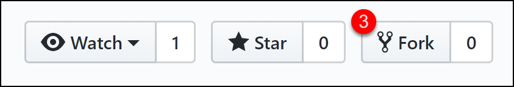
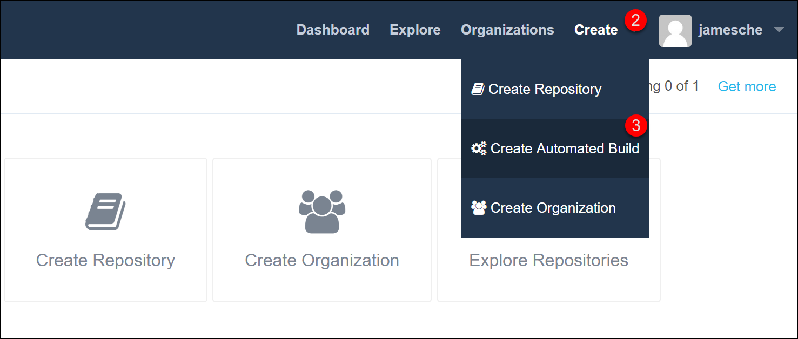
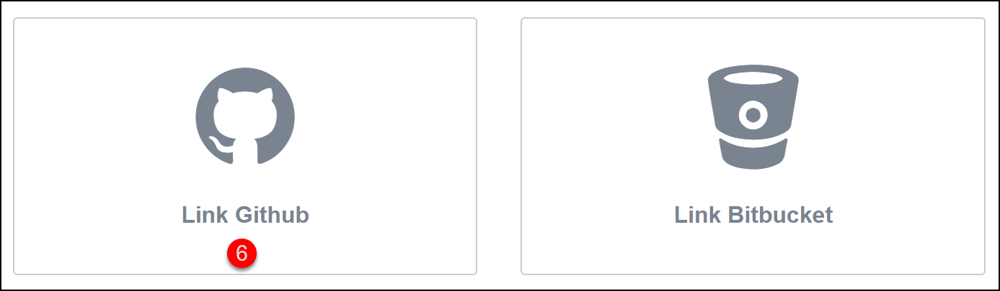
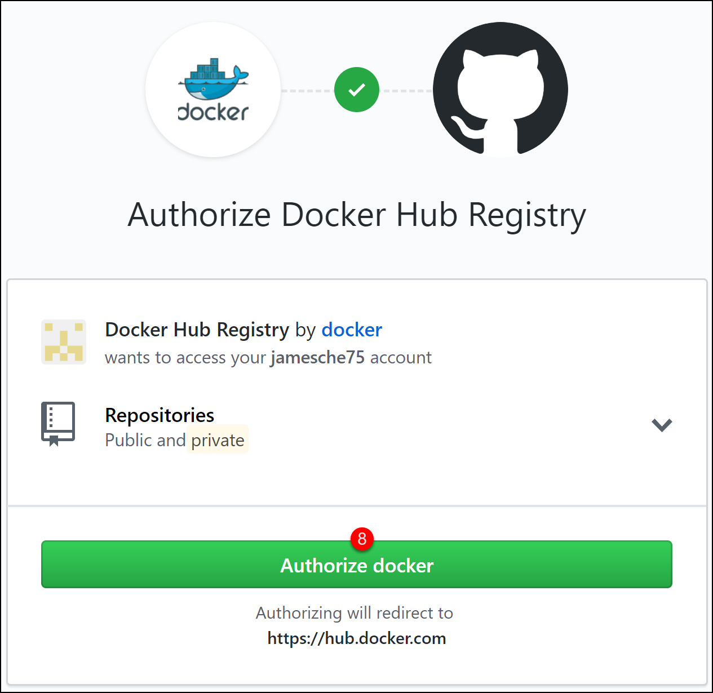
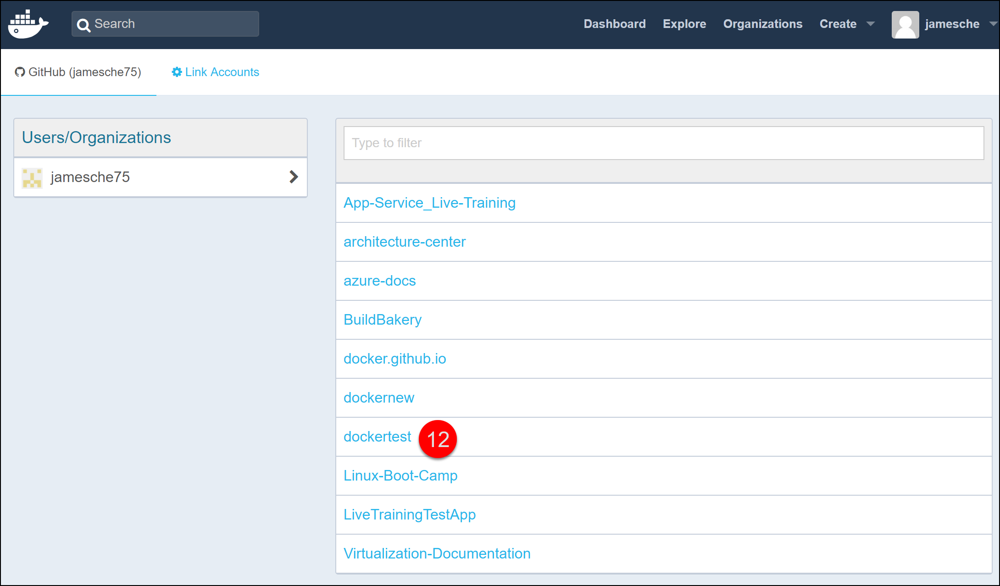
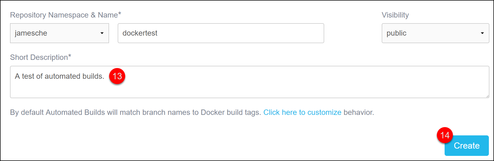
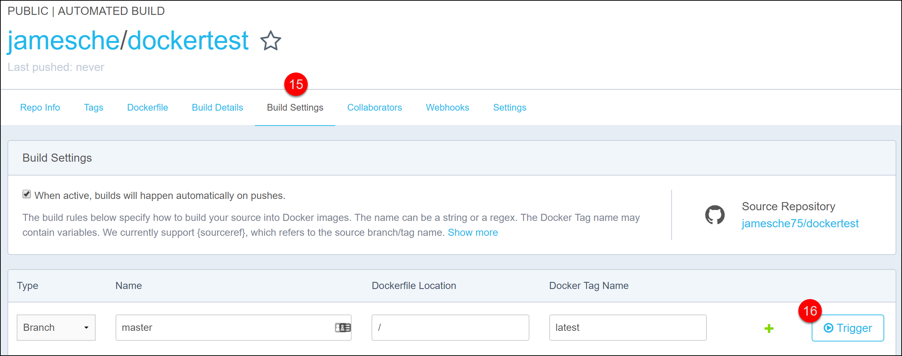
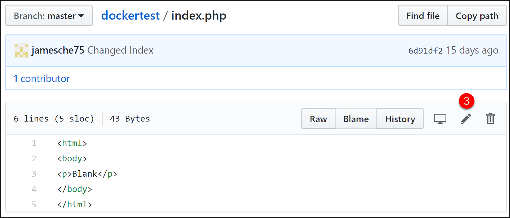
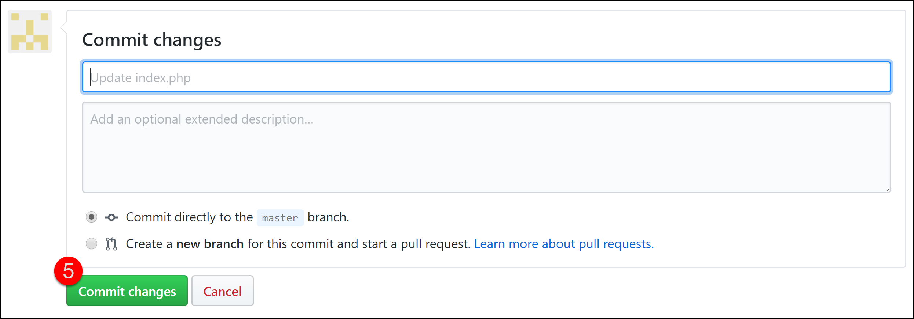
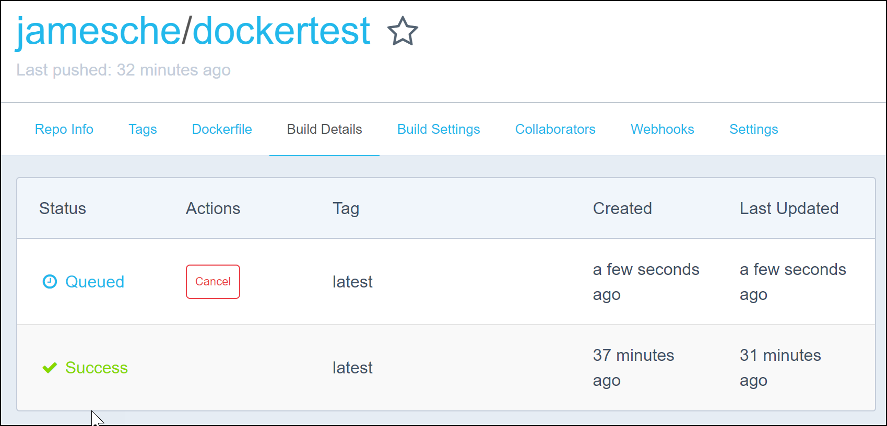

# Lab 5 - Automated Builds with Git and GitHub
In this lab, you will complete the following exercises.

* Fork a GitHub repository.
* Create a Docker Hub Docker image based on your GitHub repository.
* Make a change to the app and verify that a new Docker image is built automatically.

## Prerequisites:
In order to complete this lab, you will need:

* A GitHub account.
* A Docker Hub account.

---

## Step 1: Fork a GitHub Repository

In order to complete this lab, you need a GitHub repository for your app, and there must be a Dockerfile in that app. If you want to, you can use the **MyDockerApp** app you created in earlier labs. If you decide to do that, you'll need to get the app into GitHub yourself. We won't cover that here. 

> **Tip**: You can use [GitHub Desktop](https://desktop.github.com/) if you want to make creating your GitHub repository easy.

If you want to make this easier on yourself, follow these steps to fork my existing GitHub repository to your own GitHub account.

1. Log in to your GitHub account.
2. Browse to https://github.com/jamesche75/dockertest to access my GitHub repository that contains a sample app.
3. Click on **Fork** seen in the image below to fork my repository into your own GitHub account.



Once you fork my repository, you'll have your own copy after a few seconds. 

## Step 2: Create a Docker Image from the GitHub Repository

Now that you have a GitHub repository for your app, you can easily create a Docker image and store it in Docker Hub. In fact, Docker Hub has a feature called *Automated Builds* that make this extremely easy.

1. Log in to your Docker Hub account.
2. Click **Create**.
3. Click **Create Automated Build**.



4. Click **Create Auto-build GitHub**.
5. Click **Link Accounts** to link your accounts.


6. Click **Link GitHub**.



7. Click **Select** under *Public and Private (Recommended)*.
8. Click **Authorize Docker**.



9. In Docker Hub, click **Create** again.
10. Click **Create Automated Build**.
11. Click **Create Auto-build GitHub**.
12. Click on the **dockertest** repository.



13. Enter a description for your automated build.
14. Click **Create** to create the build.



You now have a Docker Hub repository that's linked to the GitHub repository you created earlier. If you look in the lower-right corner, you'll see a link to the GitHub repository this automated build is based on. 

Why is this called an *automated* build? When you create an automated build, in Docker Hub, it creates a webhook for you that will automatically build a new Docker image when there is a change to the GitHub repository. That's why it's an *automated* build. 

We could push a change to the GitHub repository right now in order to have Docker Hub build the Docker image, but since we don't need to make any changes to our app right now, let's just manually tell Docker Hub to create an image.

15. Click **Build Settings**.
16. Click **Trigger** to trigger the first build of your Docker image.



After you trigger a build, you can click on **Build Details** to see the status. The **Build Details** page won't automatically refresh as your image builds, so you'll have to click it again to see an updated status.

Eventually, you should see that your build completed successfully.

> **Note:** Don't worry if it seems like you're stuck in the *Building* phase. It can take a long time to build an image.

This particular Docker image is a PHP image with Apache. If you want to test it, you can create a new Web App for Containers app in Azure and point the Docker container to it. 

## Step 3: Testing the Automated Build

Let's test the automated build by making a small change to the GitHub repository. 

For this lab, you'll make a change to a PHP file directly in GitHub and then save that change directly into your master branch. In a real-world environment, you would have a local copy of the repository. You would make changes to the file, commit those changes to your local copy of the repository, and then push those changes to the GitHub repository.

1. Browse to your repository in GitHub.
2. Click on the **index.php** file.
3. Click the **Edit** button.



4. Replace the content in the file with the following code:

   ```
   <?php
      phpinfo();
   ?>
   ```
5. Click on **Commit Changes** to save your changes to the file.



If you now switch back to Docker Hub and click on **Build Settings**, you'll see that a new build has been triggered for you automatically.



> **Extra Credit:** Set up continuous deployment with Web App for Containers so that when a new change is pushed to GitHub, a new Docker image is built in Docker Hub, and Web App for Containers picks up that change and pulls your new image.


