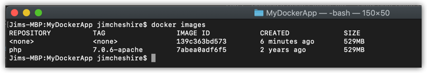

# Lab 1: Building a Docker Image

In this lab, you will complete the following exercises.

* Create a Dockerfile.
* Build a simple Docker image that runs an Apache web server.
* Examine the image on the host OS.

## Prerequisites:
In order to complete this lab, you will need:

* A [Docker Hub](http://www.dockerhub.com) (http://www.dockerhub.com) account. (It's free.)
* An install of [Docker CE](https://www.docker.com/get-started) (https://www.docker.com/get-started). You can run this on any OS. The steps aren't OS-specific.
* Download the contents of the Linux Boot Camp GitHub repository located at https://github.com/jamesche75/Linux-Boot-Camp. (Click **Clone or Download** and download it as a Zip file to your machine.)

### Optional: ###
* [Visual Studio Code](https://code.visualstudio.com/download) (https://code.visualstudio.com/download) with the [Docker extension](https://code.visualstudio.com/docs/azure/docker) (https://code.visualstudio.com/docs/azure/docker).

> **Note:** Screenshots in this lab were taken in Visual Studio Code with the Docker extension installed.

---

## Step 1: Create a Dockerfile
You'll need a Dockerfile in order to create a Docker image.

1. Create a directory called **MyDockerApp**.
2. Open a text editor.
3. Add the following to the file.

```
FROM php:7.0.6-apache

COPY apache2.conf /bin/
COPY index.php /var/www/html/
```
3. Save the file in the **MyDockerApp** directory as ``Dockerfile`` with no extension. 

> **Note:** If your text editor has encoder options, make sure that the file is encoded as UTF-8.

4. Copy the ``apache2.conf`` and ``index.php`` files from the **Linux-Boot-Camp/Modules/Module 4 - Advanced Docker/Labs/Lab1 - Building a Docker Image/Support Files** directory into your **MyDockerApp** directory.

## Step 2: Build a Docker Image
Now that you have all of the files necessary for a basic app, you're ready to build a Docker image.

1. Open a console window. This can be a terminal window, a shell console, PowerShell, etc.
2. Change into your **MyDockerApp** directory.
3. Run the following command:

    ``docker build .``

You should see ``STEP 1/3 : FROM php:7.0.6-apache``, followed by progress bars as Docker downloads and extracts your parent image. Finally, you should see the additional lines from your Dockerfile, followed by a message that the image was successfully built.

> **Knowledge Check:** 
> 1. Why do you see lines from your Dockerfile when you run ``docker build``?
> 2. What does the "." do in the ``docker build`` command?

## Step 3: Check Your Image
Let's verify that the image was successfully created. 

1. From your command prompt, enter the following command:

   ``docker images``

You should see output that looks like the following figure.



> **Knowledge Check:** Why does our image show up as ``<none>     <none>``?

We can fix the image so that it uses a name and tag that is useful to us. First, let's remove the image you just created.

2. Run the following command:

   ``docker rmi IMAGE``

   Replace ``IMAGE`` with the first couple of characters from the **IMAGE ID** column in the ``docker images`` output. For example, in my case, I used this command:

   ``docker rmi 139``

3. Run ``docker images`` again to confirm that your image has been removed. You should see that only the **php** image remains.

Now let's build the image again, but this time, we'll give it a name and a tag.

4. Make sure you're in the **MyDockerApp** directory, and run the following command:

   ``docker build -t mydockerapp:1.0 .``

> **Knowledge Check:** You likely noticed that the image built much more quickly this time. Why?

5. Run ``docker images`` again to see the new image.

> **Tip:** I could have simply had you run ``docker tag IMAGE mydockerapp:1.0`` and it would have tagged the existing image without having to rebuild it. However, I wanted you to see the difference in building the image a second time.

> **Extra Credit**: Try running ``docker images -a``. What do you see? Explain why this differs from running ``docker images`` without the ``-a`` option.


