# Module 4: Advanced Docker

This module builds on what you learned in Module 2. While most of what
you'll do in this module isn't something you'll do when supporting Azure
App Service, it will help you to have a more thorough understanding of
Docker and building Docker images.

## Prerequisites

The following prerequisites are necessary before participating in this
Boot Camp.

  - A local Docker Community Edition (CE) install. You can find it at
    https://www.docker.com/community-edition.

  - A free GitHub account.

  - A free Docker Hub account.

## Goal

After completing this Boot Camp, you will have achieved a Level 200
skill set in:

  - Building Docker images from the command line, automated build, and
    Docker Commit.

  - Using Dockerfiles and .dockerignore to automate tasks while building
    a Docker image.

  - Run a Docker image in a Docker container and interact with that container.

  - Understanding Kubernetes and Docker Compose multi-container
    deployments.

# Docker Images

Before you can start a Docker container, you need a Docker image. There
are a few different ways to create a Docker image.

  - You can use docker build to create an image using a *Dockerfile*.

  - You can use ``docker commit`` to create an image from changes you've
    made to an existing Docker container.

  - You can use the automated build features in Docker Hub to create an
    image when you push changes from a source code repository.

In this module, we'll cover all these techniques.

## Creating an Image Using docker build

When you create a Docker image using ``docker build``, you provide Docker
with a *Dockerfile* and a *build context*. A Dockerfile is a text file
that tells Docker how to build the image. The context is one or more
files located at a path or a
URL.

> **Cross-Ref:** See [**The Dockerfile**](#the-dockerfile) later in this module for details on what is contained in a Dockerfile.

The path can point to a specific directory, but it can also simply be a
period. When using a period as the path, the context will consist of all
the files in the current directory and its subdirectories. For example:

```
$ docker build /assets/website
```

or

```
$ docker build . 
```

You can also specify your image name and an optional tag. For example,
the following will create a Docker image called *MyImage* with a tag of
*v1*.

```
$ docker build -t MyImage:v1 . 
```

A URL can either be a URL to a Git repository or a URL that points to a
remote tarball. For example:

```
$ docker build https://github.com/jamesche/officewebsite 
```

or 

```
$ docker build http://mysite.com/docs.tar.gz 
```

When you run the ``build`` command, Docker will send the files to the Docker
daemon and it will use those files as the
context.

> **Note:** You must have a Dockerfile in the path or in the root of your repository. Otherwise, you will see an error. 

## Creating an Image Using ``docker commit``

Once you run a Docker container, you can make changes to the container
and then *commit* those changes to a new Docker image. For example, you
might want to install OpenSSH and some other components into an Ubuntu
container and then commit that to a new image. When the new image is
run, the resulting container will include the components you installed.

Here's an example of how this works.

```
$ docker build -t jimsubuntu:v1 . #build my image
...
$ docker run -it jimsubuntu:v1 sh #run my image
```

> **Note:** If you need to specify a port mapping, you can do that using the ``-p`` switch. However, make sure that you specify the ``-p`` switch before the image name. Otherwise, your port won’t be mapped into the container’s network and your image won’t work.

After I run my image, I'll be sitting at a shell prompt. I'll install
OpenSSH from that prompt.

```
# apt-get update
...
# apt-get install -y --no-install-recommends openssh-server
```

Once this install finishes, I can use ``docker commit`` to create a new
Docker image with the changes I've made. However, first I'll need to get
the name of the running container.

```
$ docker ps #show running containers
CONTAINER ID IMAGE COMMAND STATUS            NAMES
cd6f147957ca jimub "sh"    Up About a minute goofy_bardeen
```

(I have removed some of the output of this command.) When you run ``docker
commit``, you can either use the container ID or the container name. I'm
going to use the container name, ``goofy\_bardeen``.

```
$ docker commit goofy\_bardeen jimsubuntu:v2
```

When I run this, I'll end up with a new Docker image called
jimsubuntu:v2 that contains the contents of the original Docker image,
plus any changes I made to the running
container.

> **Note:** The name "goofy\_bardeen" was given to the container by the Docker daemon because I didn't explicitly give it a name when I started it.

Using ``docker commit`` has some serious drawback. The primary drawback is that the Docker image it creates isn't really maintainable. Suppose you wanted to change the parent image for your newly created Docker image. You can't, because there isn't a Dockerfile to edit. 

It's also important to note that a Dockerfile can contain valuable documentation of how a Docker image is created. (Of course, this relies on the Dockerfile author actually writing a well-documented Dockerfile.) If you use ``docker commit`` to create an image, you lose that benefit. 

Given those drawbacks, why would you ever want to use ``docker commit``? You may want to change something minor in an image for testing purposes, and ``docker commit`` is a good choice for that. As a general rule, if you are building an image that you intend to use more than once, use a Dockerfile instead of ``docker commit``.

## Using an Automated Build with Docker Hub and GitHub

Running Docker from the command line is a great way to get more familiar
with how everything works. It's also the preferred way for many people
because it gives them complete control. However, it's not the most
efficient workflow.

If a customer is using GitHub, it's quite easy to configure an automated
build in Docker Hub so that when new code changes are pushed to the
repo, a new Docker image is built automatically. Combine this workflow
with continuous integration in Web App for Containers and you have an
efficient and automated process of building your images.

### Step 1: Create GitHub Repository

The first step is to add your files (including your Dockerfile) into a
GitHub repository. You can use the Git command line or GitHub Desktop to
easily add your files.

### Step 2: Link Your GitHub Account to Docker Hub

Next, you'll need to link your GitHub account to Docker Hub. To do that,
first click on **Create**, **Create** **Automated Build** in Docker Hub
as shown below.

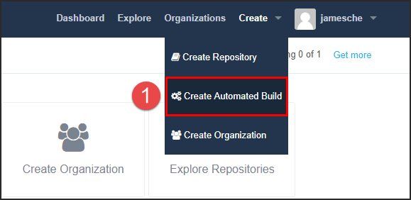

Then you'll need to click on **Link Accounts** to link your GitHub
account.


Next, you'll click on **Link Github** to link your GitHub account to
Docker Hub.

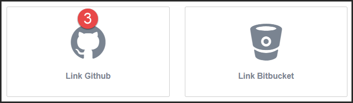

Next, you'll choose between **Public and Private** or **Limited
Access**. **Public and Private** is recommended.

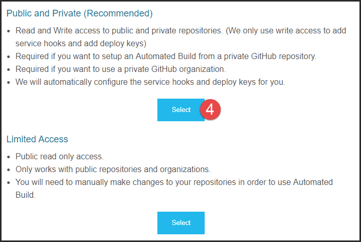

You'll be redirected to GitHub where you'll want to click on **Authorize
Docker** to complete the connection. (If you aren't logged into GitHub,
you'll be prompted to do that first.)

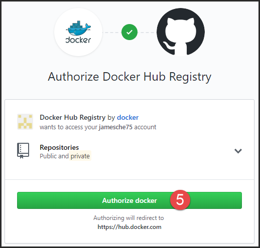

Now you can click on **Create**, **Create Automated Build** again and you'll see
the option to create an auto-build from GitHub.

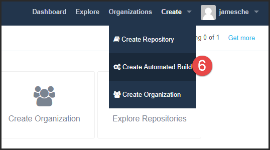

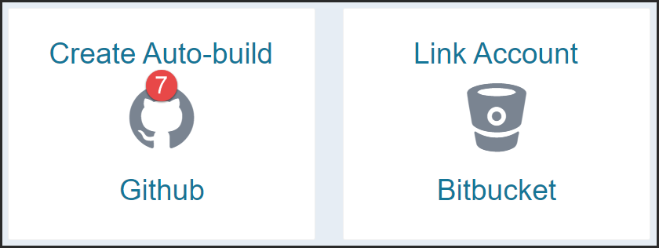

Click on the GitHub repository that you want to use for your Docker
image.

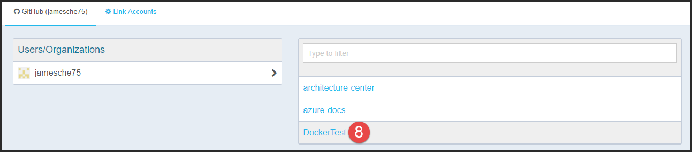

Give your automated build a short description and then click on
**Create** to create your Docker Hub repository linked to the GitHub
repository.

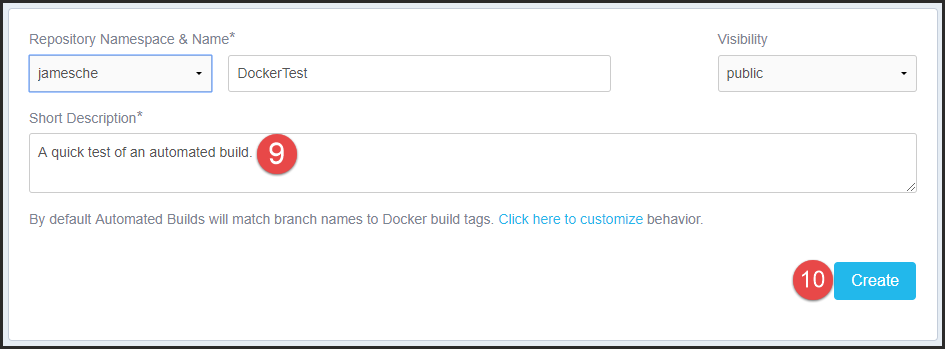

At this point, if you push new changes to your GitHub repository, a new
Docker image will be created. However, if you want to create a Docker
image from the files currently in the GitHub repository, you'll need to
manually trigger your first build.

Click on **Build Settings** in Docker Hub and then click on **Trigger**
to trigger a build.

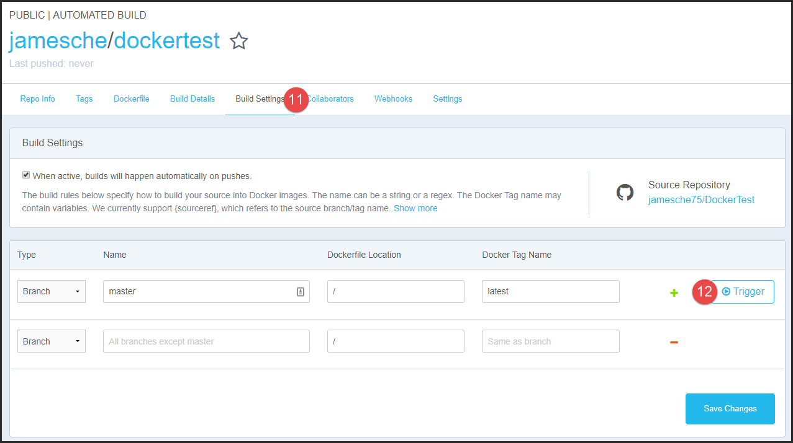

You can view the status of your build by clicking on **Build Details**.
Note that the build status isn't updated in real-time, so you'll need to
click on **Build Details** to refresh the status.

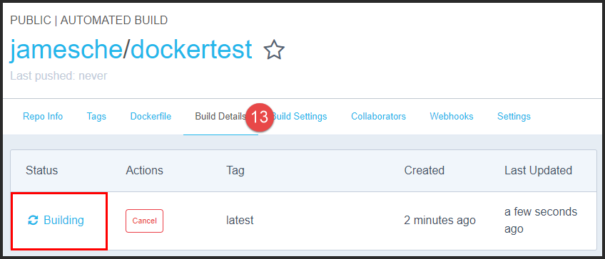

Note that after the initial build, you will not have to manually trigger
a build. The automated build will automatically trigger when you push
changes to your GitHub
repository.

> **Note:** You should also configure CI/CD in Web App for Containers at this point. See **Module 5 - App Service and Linux** for more details.

We'll go into the details of how you run a Docker container in the [**Running a Container**](#running-a-container) section. Before we do that, let's look at what a Dockerfile is.

# The Dockerfile

As stated earlier, a Dockerfile is simply a text file that contains the
information necessary to build an image. A Dockerfile consists of one or
more instructions the Docker daemon uses to build an
image.

> **Note:** Your Dockerfile cannot be empty. If it is, an error will occur when you try to build your image. 

## The FROM Instruction

Your Dockerfile must have at least one ``FROM`` instruction. The ``FROM``
instruction specifies the image your Docker image is based upon. For
example, if you want to base your image on the official Ubuntu image in
Docker Hub, your Dockerfile would start with:

```
FROM ubuntu
```

Note that the repository name must be all lowercase.

The image specified in the ``FROM`` instruction is referred to as the *parent image* of your image. You'll sometimes see people (including Docker documentation) refer to it as the *base image*, but technically, it's not the base image.

> **Cross-Ref:** See [**The Chicken or the Egg - Parent and Base Images**](#the-chicken-or-the-egg---parent-and-base-images) later in this module for more details.

If your Dockerfile contains nothing else other than this single ``FROM``
instruction, your image will be a duplicate of the Ubuntu image.
However, most of the time, you'll want to add additional instructions to
your Dockerfile. For example, you might want files that are in your
build context to be added to your image. (We'll cover more on that later
in the [**Adding Files from the Context**](#adding-files-from-the-context)
section.)

> **Note:** Docker recommends the Alpine image as a parent image. It's lightweight and has a complete package index, so it's easy to add what you want without too much overhead.

## The Chicken or the Egg - Parent and Base Images

If you're really paying attention, you might be asking a question at
this point. If you *must* have a ``FROM`` instruction, how did the creator
of the Ubuntu Docker image create that image? The Ubuntu image isn't
based on another image. It's simply the Ubuntu OS packaged into a Docker
image.

A Docker image that has no parent image is called a *base image*. You
create a base image by using the following ``FROM`` instruction in your
Dockerfile.

```
FROM scratch 
```

This instruction specifies that the image doesn't have a parent image
it's based upon. It's a completely fresh image.

By the way, the official Docker documentation says a base image can be
created by including a Dockerfile without a ``FROM`` instruction. This is
untrue. Docker requires your Dockerfile have at least one ``FROM``
instruction.

## Multiple Parents

Your image can have (and often will have) more than one parent image.
For example, suppose you not only want to create an image based on the
Ubuntu image, but you also want that image to have Apache included in
it. To accomplish that, your Dockerfile might have the following ``FROM``
instructions.

```
FROM ubuntu
FROM httpd # The Apache HTTP Server Project
```

The "#" character you see in the above example is a comment character.
Anything that appears after the "#" is considered a comment. This is an
excellent way to document your Dockerfiles.

## Adding Files from the Build Context

As you learned earlier, when you run ``docker build``, Docker transfers the
files in the context to the Docker daemon. What you might not have
realized is the transfer of these files simply makes them available to
the Docker daemon. It doesn't copy any of those files into your Docker
image. To add files from the context into your image, you need
instructions in your Dockerfile.

To add files from the context to your image, you can use the ``ADD`` or ``COPY``
instruction. For example:

```
COPY index.html /var/www/html
```

The ``ADD`` instruction is similar, but it has additional capabilities. Most
commonly, ``ADD`` is used when you want to extract a tar file into your
image. For example, the following two instructions do something
completely different.

```
COPY bigfiles.tar.xz /bigfiles
ADD bigfiles.tar.xz /bigfiles
```

The ``COPY`` instruction will copy the bigfiles.tar.xz file to the bigfiles
directory in my image. The ``ADD`` instruction, on the other hand, will
auto-extract the bigfiles.tar.xz file into the bigfiles directory in my
image.

## Running Commands

Another common instruction used in Dockerfiles is the ``RUN`` instruction.
The ``RUN`` instruction runs a command. This is commonly used to install
components in the container or to change permissions on files. For
example, consider the following snippet from a Dockerfile.

```
RUN apt-get update
RUN apt-get install -y --no-install-recommends openssh-server
RUN \
  chmod 777 /var/log \
  chmod 777 /var/run
```

In this example, the ``RUN`` instruction is used to run the Advanced Package
Tool (APT) to install OpenSSH server and then change the permissions on
a couple of directories. The "\\" character is used when you want to
continue the ``RUN`` instruction on a new line.

When the ``RUN`` instruction is used, the command is executed in a new layer on top of the existing Docker image. The change is then committed to a new image. You'll learn more about comitting changes to a new image later in this module.

It's important to understand that instructions in the Dockerfile are *not* executed on the OS after the Docker container is running. The Dockerfile is used solely to instruct the Docker daemon how to build the image.

## Exposing Ports

App Service apps are all web-based, so your containers will need to
expose a port to the outside world so users can access it. You use the
``EXPOSE`` instruction to do that.

```
EXPOSE 80 2222 
```

In the snippet above, two ports are exposed; 80 and 2222. You'll
commonly see this in App Service because custom containers need to
expose port 2222 if they want to use web-based SSH.

## Setting Environment Variables

If you need to set environment variables in your image, use the ``ENV``
instruction.

```
ENV PATH /usr/local/nginx/bin:$PATH 
```

The snippet shown will add ``/usr/local/nginx/bin`` to the existing ``PATH``
environment variable in the image. Like the ``RUN`` instruction, the ``ENV``
instruction creates a new layer.

## Executing Commands on Container Start

When a container starts, something needs to run so that it can be used.
For example, if your container runs Ubuntu, you will want to run Bash
when it starts so users can get to the command line. If your container
runs Nginx, you will want to run "nginx."

To run commands on container start, you can use the ``ENTRYPOINT`` and ``CMD``
instructions. Consider the following snippet.

```
FROM ubuntu
ENTRYPOINT ["/bin/bash"]
```

When this Docker image is run, a container is created, and Bash is
executed. Now consider this example.

```
FROM ubuntu
CMD ["/bin/bash"]
```

This snippet does the same thing. In this example, ``ENTRYPOINT`` and ``CMD``
are interchangeable. However, there are differences. Consider this
example.

```
FROM ubuntu
ENTRYPOINT ["ping", "www.microsoft.com"]
CMD ["hub.docker.com"]
```

When this container is run, the command executed by the ``CMD`` instruction
will be appended to what is run by the ``ENTRYPOINT`` instruction. In other
words, both www.microsoft.com and hub.docker.com will be pinged.

### Two Forms of ENTRYPOINT and CMD

All the examples shown so far are using the *exec* form of ``ENTRYPOINT``
and ``CMD``. (The exec form uses commands enclosed in square brackets.)
There's another form of ``ENTRYPOINT`` and ``CMD``, and that's the *shell* form.
The commands behave differently if you use the shell form.

Consider the following example using the shell form.

```
FROM ubuntu
ENTRYPOINT exec ping www.microsoft.com
CMD hub.docker.com
```

When this container is run, www.microsoft.com will be pinged, but
hub.docker.com will not be. That's because ``CMD`` instructions following
an ``ENTRYPOINT`` instruction in shell form are
ignored.

> **Note:** If you are using both ``ENTRYPOINT`` and ``CMD`` instructions, make sure you use the same form (either exec or shell) for both. Don't mix the two forms.

The exec form is the preferred form, but it does have some shortcomings
you need to be aware of. When using the exec form, the command you run
doesn't have access to environment variables. For example, the following
snippet will not work correctly.

```
FROM openjdk:8-jdk-alpine
CMD ["java", "-jar", "*.jar"]
```

Because the command doesn't have knowledge of the ``$PATH`` environment
variable, it won't know where the Java executable is, so this won't
work. Also, I'm using a wildcard here, and since wildcards are evaluated
by the shell, that won't work either. This is an example of a subtle
problem you might encounter.

## Initialization Scripts

It's common for a developer to want to run many commands when a
container is started. An initialization shell script is a common method
of doing that. Once the script is ready and added to the Docker image,
it can be executed using ``ENTRYPOINT``. Here's an example.

```
FROM nginx
COPY init.sh /bin/ # copy the script to the /bin directory.
RUN chmod 755 /bin/init.sh # set permissions
ENTRYPOINT ["/bin/init.sh"]
```

This is something you'll commonly see in App Service because our
guidance on building custom images recommends it.

## Using .dockerignore

As you've learned, when you build a Docker image, Docker sends the build
context (all of the files in the path you specify) to the Docker daemon.
You should make sure that you don't include unnecessary files in the
build context, and you can exclude files using a *.dockerignore* file.

Why exclude files? You might have some large files in your directory
path that you don't need in your Docker image. If you include those
files in the build context, they'll have to be uploaded to the Docker
daemon, and that can take a lot of time. You might also have some files
with private or sensitive information in them that you don't want
included. For these reasons, it's considered a best-practice to *always*
use a .dockerignore file.

The .dockerignore file uses the *Match* function in the Go language to
match files. (You can see the documentation on the Match function at
https://golang.org/pkg/path/filepath/\#Match.) However, Docker adds an
additional wildcard string of ** that matches any number of
directories. For example, to ignore all files with a ``.tmp`` file extension
in all directories, you can include the following in your .dockerignore
file.

```
**/*.tmp
```

This will exclude all ``.tmp`` files, even those in the root
folder.

For more information on the .dockerignore file, see https://docs.docker.com/engine/reference/builder/\#dockerignore-file. 

# Running a Container

Once you've created a Docker image, you can use ``docker run`` to run a container from that image. In this section, we'll look at how to run a container, and how you can interact with that container after it's running.

## Using ``docker run``
To run a Docker container, you use the ``docker run`` command. When you run this command, Docker will check to see if the Docker image needed for the container is on the local machine. If it's not, Docker will automatically do a ``docker pull`` to download and extract the image. 

Once the image is available on the local machine, Docker will create a Docker container and run it using the parameters that you passed to ``docker run``. 

As you've already seen, a Docker image developer can specify many settings to be used by the image. These settings can be thought of as the *default* settings for a container derived from the image. When you use ``docker run``, you can override these settings using options passed to ``docker run``.

Here's a very basic ``docker run`` command that starts a container based on an image named *mycoolimage* with a tag of *latest*.

``docker run -it mycoolimage:latest``

When this command runs, a new Docker container is created on the machine and then it's started. Once it's started, it's considered to be in a running state. 

> **Note:** You can also use ``docker create`` and ``docker start`` separately to start and run a container. Using ``docker run`` simply does both for you with one command.

You can use the ``docker ps`` command to see a running container as shown in the figure below.

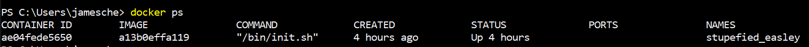

In the ``docker ps`` output shown above, you can see the the following columns.

- **Container ID** - Partial output of the unique hash that identifies the container.
- **Image** - Image name or a partial output of the unique hash that identifies the image from which the container is derived.
- **Command** - The command that was executed when the container started. 
- **Created** - How long ago the container was *created*. Remember, when you use ``docker run``, Docker both *creates* and *runs* a container. 
- **Status** - The current status of the container. If you run ``docker ps`` with no other options, you will only see running containers, so this column tells you how long it's been running.
- **Ports** - Any port mappings for your container. 
- **Names** - You can give the container a name when you use ``docker run``, but if you don't, Docker assigns a name for you.

It's possible that a Docker container that's previously been running on the machine is no longer running. In that case, you will need to run ``docker ps -a`` to see it. 

> **Note:** You can use ``docker start`` to start a container that's currently not running.

## Common ``docker run`` Options
Many (but not all) of the options for ``docker run`` are used to override many of the settings the image developer configured in the Dockerfile. For that reason, there are a *lot* of options available to you. In fact, ``docker run`` has more options than any other command.

> **Note:** The only Dockerfile instructions that cannot be overridden in ``docker run`` are FROM, MAINTAINER, RUN, and ADD. Everything else has an option in ``docker run`` that can be used to override it. 

The format for ``docker run`` is:

``docker run [OPTIONS] IMAGE[:TAG] [COMMAND] [ARG . . .]``

The only required parameter is the image name. It's important to note that any options you use are specified *before* the image. Otherwise, those options become part of the command, and you'll get unexpected results.

If you specify a COMMAND in ``docker run``, it overrides the CMD instruction from the Dockerfile. If there is an ENTRYPOINT in the Dockerfile, COMMAND will be appended as an argument to the ENTRYPOINT, provided you're using the exec form of ENTRYPOINT.

Here are some of the more common options used with ``docker run``.

| Option       | Description                                     |
| ------------ | ----------------------------------------------- |
| -d           | Start container in *detached* mode.             |
| -a           | Attach to STDIN, STDOUT, and/or STDERR.         |
| -i           | Start container in interactive mode.            |
| -t           | Allocate a TTY for the container.               |
| --name       | Specify a name for the container.               |
| --dns        | Set custom DNS servers for the container.       |
| --restart    | Specified the restart policy for the container. |
| -p           | Publishes a port to the host OS interfaces.     |
| --entrypoint | Used to override ENTRYPOINT in a Dockerfile.    |
| --expose     | ADDs to any ports exposed with EXPOSE.          |
| --link       | Adds a link to another container.               |
| -e           | Set (or override) environment variables.        |

When you start a container detached, the container will exit when the process that runs the container exits unless you also use the ``--rm`` option. This is important to keep in mind because it can cause your container to start and immediately stop.

If you want to start a Docker container and have access to a terminal session in that container, you should start the container using the ``-i`` and ``-t`` options. You can combine these two options as shown below.

``docker run -it myimage``

If the Dockerfile for ``myimage`` doesn't run a shell, you can also specify a command like so.

``docker run -it myimage /bin/bash``

When this runs, the container will be started and you'll be presented with a command prompt running in the container. 

## Interacting with a Running Container
Once your container is running, you can interact with it in various ways. You can run commands in the container, you can stop the container, you can restart the container, you can copy files to and from the container, and so forth.

### Running Commands in a Container

If you started your container in detached mode (using ``-d``), you can attach to it by running the following command.

``docker attach CONTAINER``

However, depening on how the container was started, you might not get what you expect. For example, if it wasn't started with a TTY, you won't be able to interact with the command prompt after running ``docker attach``. For that reason, it's usually best to use ``docker exec`` instead.

When you use ``docker exec``, you can specify the command you want to run inside of the container, along with some options. Here's the format for ``docker exec``.

``docker exec [OPTIONS] CONTAINER [ARGS]``

Consider the following partial output of ``docker ps``.

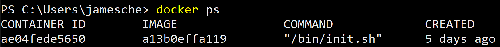

If I wanted to get an interactive command prompt inside of this container, I can do that by running the following command.

``docker exec -it ae /bin/bash``

This will give me a Bash command prompt inside of the container, and because I used the ``-it`` option, that interactive command prompt also makes a TTY available so that I can see output from it. 

> **Note:** Remember, you don't have to enter the entire container ID when using ``docker`` commands. You only have to enter enough characters so that Docker can uniquely identify the container. 

Note that the commands you use with ``docker exec`` don't have to be interactive commands. For example, the following command creates a new file called ``myapp.log`` in the /var/log directory. 

``docker exec -d ae touch /var/log/myapp.log``

> **Note:** When you run commands using ``docker exec`` in the background (using the ``-d`` option), you won't get any ouput from the command. In other words, if there is an error, you won't see it. 

### Stopping and Starting Containers


# Multi-Container Deployments

As you've already seen, you can use a Dockerfile to create a container
that is based off of multiple parent containers. However, you may also
want to separate certain tiers of an application into separate Docker
containers.

For example, perhaps you have a database server, a web application, and
a caching component to your application. Separating each of these into a
separate Docker container provides you with a more efficient means of
deploying and updating your application. In such situations, you can use
a multi-container deployment. In App Service, we support both Docker
Compose and Kubernetes (K8s) for multi-container deployments.

## Docker Compose

Docker Compose allows you to define the *services* that make up an
application using a YAML file. Each service equates to a Docker image,
and you can specify many settings for each of these images.

> **Note:** We'll cover this information again (and with more detail) in Module 5. In this section, you'll learn how multi-containers work in general. Module 5 covers how we implement it in App Service.

A Compose application's services are defined in a Compose file. The
Compose file is typically named *docker-compose.yml*, but it's possible
to pass your own filename when you start a Compose application.

Below is a simple Compose file that defines two services, *webapp* and
*database*.

```
version: '3'

services:
  webapp:
    image: djangoweb
    ports: 80
  database:  
    image: mysqldb:weblatest
    ports: 3306
```

Once you've defined the services, you start the app using the
``docker-compose up`` command.

```
$ docker-compose up -d 
```

When you run this command, Docker will look for a ``docker-compose.yml``
file in the current directory. If it doesn't find one, an error will
result. In order for the app to successfully start, all of the services
defined in the Compose file must start. If any of them fail to start,
the entire app will fail.

Once the app has started, you can stop the app by running ``docker-compose
down``.

## Kubernetes (K8s)

Kubernetes (often referred to as Kube or K8s) is another orchestration service
that allows you to define a multi-container deployment. In App Service,
we support the deployment of Kubernetes *pods* only. A pod is a multi-container
app where all containers run on the same host.

Much like a Compose application, a Kubernetes pod is defined using a
configuration file. The configuration file can be in JSON format or in
YAML format, but in App Service, we support the JSON format only.

Here's a simple pod configuration file.

```
apiVersion: v1
kind: Pod
metadata:
  name: JimsPod
  namespace: WebApp11
spec:
  containers:
    - image: djangoweb
      name: webapp
      ports:
        - containerPort: 80
    - image: mysqldb:weblatest
      name: database
      ports:
        - containerPort: 3306
```

To run the app, run ``kubectl create`` and pass in the filename.

```
$ kubectl create -f webapp-config.yml 
```

You can then see the pod by running ``kubectl get pods``.

```
$ kubectl get pods
NAME    READY STATUS   RESTARTS AGE
JimsPod 1/1   Running  0        10m
```

To delete a pod (and shut down the app), use ``kubectl delete``.

```
$ kubectl delete pod JimsPod 
```
