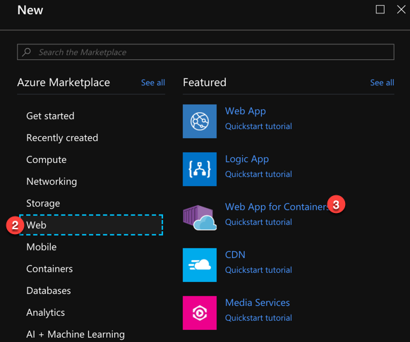
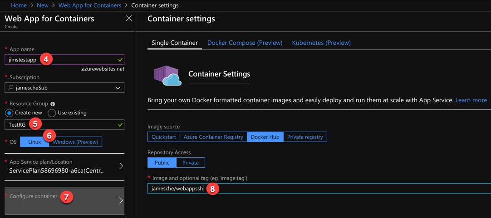
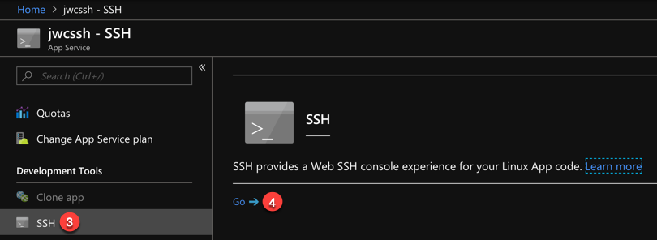

# Lab 1 - Using SSH with App Service
In this lab, you will complete the following exercises.

* Create a new Docker image using the Docker CLI.
* Push your Docker image to Docker Hub.
* Configure the image for SSH and update it.
* Open a TCP tunnel and SSH into your container.

## Prerequisites:
In order to complete this lab, you will need:

* An Azure account.
* The latest version of the Azure CLI. You can download this from https://docs.microsoft.com/en-us/cli/azure/install-azure-cli?view=azure-cli-latest.
* A Docker Hub account.
* An SSH client. You can use Putty (https://www.putty.org/), PowerShell, a Terminal window on a Mac, a shell prompt in Linux, etc.

> **Note:** The Azure CLI is cross-platform, so you can run this lab from a Linux machine, a MacOS machine, or a Windows PC. 
---

## Step 1: Create a New Docker Image
So far, you've created a new Docker repository in Docker Hub by creating an automated build. While it's useful to know how to do that, it's also useful to know how to manually push an image to Docker Hub. That's what you're going to do now.

1. Create a new folder on your computer called **WebAppSSH**.
2. Create a new, empty file and copy the following contents into it.

   ``FROM appsvc/node``

3. Save the file in the **WebAppSSH** directory as **Dockerfile** with no file extension. 

> **Note:** If you're doing this on Windows and you have file extensions hidden, you'll likely end up with a file called *Dockerfile.txt*. Make sure that you show file extensions and don't add a file extension to the file or it won't work.

3. From a command prompt, switch into the **WebAppSSH** directory.
4. Run the following command to build a new image.

   ``docker build -t <docker_hub_id>/webappssh:latest .``

   Replace ``<docker_hub_id>`` with your Docker Hub username. For example, my Docker Hub username is jamesche, so I would run:

   ``docker build -t jamesche/webappssh:latest .``

## Step 2: Push Your Image to Docker Hub
You will need to push your image to a Docker registry in order to use it with Web App for Containers. Let's push this image to Docker Hub.

1. Run the following command to log into Docker Hub.

   ``docker login``

   If it asks you for your username and password, enter your Docker Hub username and password. (Note that it will not show you your password as you enter it.)

2. Run the following command to push your new image to Docker Hub.

   ``docker push <docker_hub_id>/webappssh:latest``

> **Note:** Your Docker Hub ID is necessary when you name your image. Otherwise, Docker doesn't know where to put your image when you push it to Docker Hub. In this context, your user ID is called the *namespace* for your image.

## Step 3: Create a Web App Based on Your Image
Now that you have a Docker image in a Docker registry, you can use that image to create a new Web App for Containers app. 

1. In the Azure portal, click **Create a Resource**.
2. Click on **Web**.
3. Click on **Web App for Containers**.



4. Enter a name for your new Web App.
5. Enter a Resource Group name.
6. Make sure you choose **Linux** as your OS.
7. Click **Configure Container**.
8. Enter your image name in Docker Hub.



9. Click **OK**.
10. Click **Create** to create the new Web App.

## Step 4: Testing Your App
In this step, you'll browse to your new app and check to see if SSH access is working.

1. Open your Web App in the Azure portal.
2. In the Overview blade, click on **Browse**. (You can also browse directly to **http://<your_site_name>.azurewebsites.net**.)
   
You should see a page that says, "Your App Service app has been created."

3. In the menu in the Azure portal, click on **SSH**.
4. Click **Go** to use WebSSH to access your Web App over SSH.



> **Questions**
>
> 1. What happened when you click Go? Were you able to successfully access your app using SSH?
>
> 2. In our documentation, we explain that you must go through some special steps in order to enable SSH in custom containers. Why did you not have to follow these steps?
>
> **Takeaway**
>
> When you use a parent image in your Dockerfile, you get everything that image includes in its Dockerfile. Since your parent image is one of our blessed images, your Docker image already contains all of the components and steps necessary to enable SSH into App Service.

## Step 5: Changing Your Docker Image
Let's change the Docker image so that it uses a different image as its parent.

1. Open the Dockerfile in the WebAppSSH directory.
2. Change the **FROM** instruction to the following:

   ``FROM php:7.2.9-apache-stretch``

3. Create a new empty file in the WebAppSSH directory.
4. Add the following content to the file:

   ```
   <?php
      phpinfo();
   ?>
   ```
5. Save the file as **index.php** in the WebAppSSH directory.
6. Add the following to your Dockerfile. (If you closed it after Step 2, open it again and add this instruction.)

   ```
   COPY index.php /var/www/html/
   ```
7. Save the Dockerfile.
8. From the command line, make sure you are in the WebAppSSH directory.
9. Enter the following command:

   ``docker build -t <docker_hub_id>/webappssh:latest .``

10.  Once your image finishes building, enter the following command:

   ``docker push <docker_hub_id>/webappssh:latest``

11. From the Azure portal, stop your Web App and then restart it.

If you now browse to your Web App, you should see a PHP page showing the PHP settings. 

> **Knowledge Check:** You might have seen the Web App based on our blessed image for a short while before you saw the site based on the new image. Why?

8. In the Azure portal, click on **SSH** on the menu.
9. Click **Go** to SSH into your Web App.

> **Questions**
>
> 1. What happened when you click Go? Were you able to successfully access your app using SSH?
>
> 2. Why are you now able to SSH into the app?
>
> **Takeaway**
>
> The **php** image wasn't built using the custom steps necessary to implement SSH functionality for Azure App Service. You see **ECONNREFUSED** on port 2222 because the app container rejected the connection. 
> 
## Step 6: Adding App Service SSH Functionality
In this step, you will edit the Docker image so that SSH in App Service will work. 

### Add SSH Server Support
The first thing you need to do to enable SSH in an image is add SSH Server support. You do that by installing the **openssh-server** package via your Dockerfile.

1. Open your Dockerfile.
2. Add the following instruction.

   ```
   RUN apt-get update \
       && apt-get install -y --no-install-recommends openssh-server \
       && echo "root:Docker!" | chpasswd
   ```
> **What did I do?**
> 
> The instruction you just added to the Dockerfile does three things. First, it updates the package index (``apt-get update``), then it installs **openssh-server**, passing ``-y`` and ``--no-install-recommends`` to prevent the command from failing when run non-interactively. Finally, it sets the root password to ``Docker!``, a requirement for our SSH implementation.

### Add an *sshd_config* File to Your WebAppSSH Directory
The *sshd_config* file is used to configure SSH. It's important that you have an *sshd_config* file that contains specific entries required for App Service. 

1. Create a new, blank text file in your WebAppSSH directory. 
2. Save the file as **sshd_config** with no file extension.

> **WARNING**: If you are on Windows and have file extensions hidden, you may unintentionally add a *.txt* file extension to the file. Make sure that you are showing file extensions so you don't encounter a problem.

3. Browse to https://github.com/Azure-App-Service/node/blob/master/8.2.1/sshd_config.
4. Add the contents of the file at the above location to your **sshd_config** file.

> **Note:** The link to the above sshd_config file is also in our documentation.

5. Save the **sshd_config** file.

### Add a ``COPY`` Instruction to Your Dockerfile
The **sshd_config** file you just added to the WebAppSSH directory needs to be copied to the ``/etc/ssh/`` directory when your Docker image is built. 

1. Open your Dockerfile.
2. Add the following instruction to the file.

   ``COPY sshd_config /etc/ssh/``

3. Save the file.

### Ensure that Port 2222 is Exposed
Our SSH implementation works over port 2222 in the Docker container. Therefore, you need to ensure that you expose port 2222 in your Dockerfile.

1. If your Dockerfile is closed, open it.
2. Add the following instruction to your Dockerfile.

   ```EXPOSE 2222 80```

3. Save the file.

## Step 6: Creating a Script to Configure SSH

### Create a Script to Start the SSH Service
In order for the SSH server to work, the daemon needs to be started when the app container starts. You do that with an initialization script. 

1. Create a blank text file.
2. Add the following to your file.

   ```
   #!/bin/bash
   service ssh start
   ```
3. Save the file as **init_container.sh** in the WebAppSSH directory.

### Configure the Startup Script in Your Dockerfile
You need to copy the startup script, set the right permissions, and set the script as the entrypoint for the Docker container.

1. If your Dockerfile is closed, open it.
2. Add the following to your Dockerfile.

   ```
   COPY init_container.sh /bin/
   RUN chmod 755 /bin/init_container.sh
   ENTRYPOINT ["/bin/init_container.sh"]
   ```
3. Save the Dockerfile.

### Test Your App
Now let's test our app and see what happens.

1. From your command line, run the following commands in order.

   ```
   docker build -t <docker_hub_id>/webappssh:latest .
   docker push <docker_hub_id>/webappssh:latest
   ```
2. Once the push is complete, stop and start your Web App.
3. Browse to your Web App to test it.

> **Questions**
>
> 1. What happened when you browsed your app?
>
> 2. The app worked before. Why does it not work now?
>
> **Takeaway**
>
> By adding an ``ENTRYPOINT`` instruction to your Dockerfile, you have overridden the ``ENTRYPOINT`` from the parent Docker image. Therefore, now that you are running ``init_container.sh``, Apache is no longer running in the container. We'll fix that in the next step.
> 
### Start Apache
Now that you've overridden the ``ENTRYPOINT`` instruction from the parent image, you need to run Apache from inside of your initialization script. 

1. Open init_container.sh.
2. Add the following line to the script.

   ```apache2-foreground```

3. Save the file.
4. From your command line, run the following commands in order.

   ```
   docker build -t <docker_hub_id>/webappssh:latest .
   docker push <docker_hub_id>/webappssh:latest
   ```
5. In the portal, stop and start your Web App.
6. Browse to the Web App.

You should now see the PHP information page again. 

If you test SSH into your app at this point, you should be able to connect successfully.

**IMPORTANT NOTE:**
This is simply an exercise to show you how to implement SSH. As a matter of best practice, you should ensure that your container is designed to scale out within App Service. For that reason, you should follow the guidance shown in class that illustrates how to include the instance name in your Web Server logs, etc.

# Additional Lab
Follow the steps at https://aka.ms/ThingsYouShouldKnow/AppServiceSSH to open an SSH tunnel and use the SSH client of your choice to SSH into your Web App.


